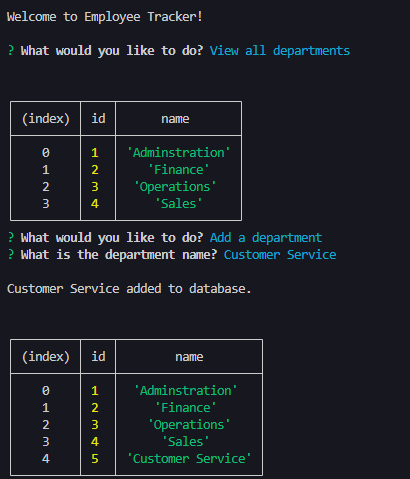
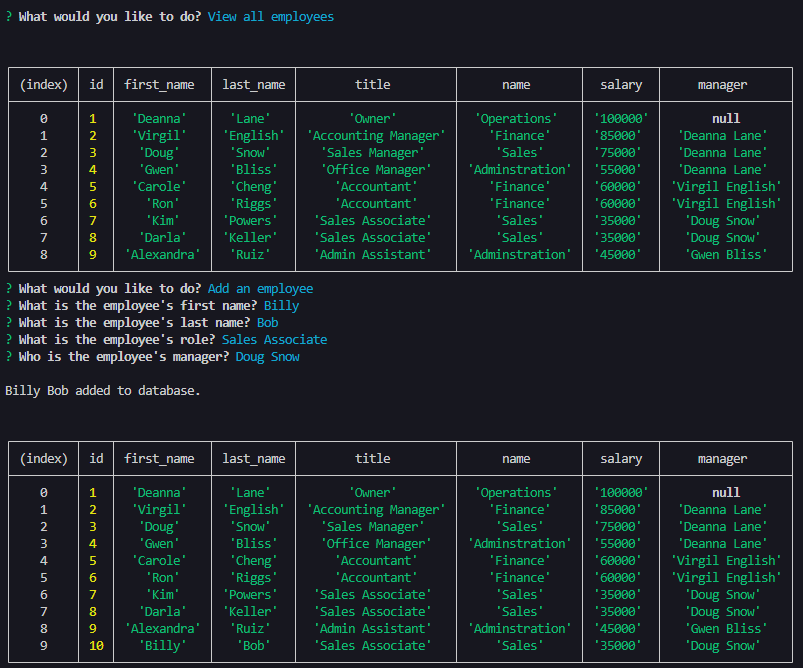

# Employee Tracker

## Table of Contents
- [Description](#description)
- [Features](#features)
- [Demo](#demo)
- [Installation](#installation)
- [Screenshots](#screenshots)
- [Credits](#credits)
- [License](#license)

## Description

Employee Tracker is a friendly UI or **content management systems (CMS)** that allows anyone to easily view and interact with information stored in the employee database.

Interactions include:

* Add a department
* Add a role
* Add an employee
* Update an employee role
* View all departments
* View all roles
* View all employees
* View employees by department
* View employees by manager

## Features

* [Node.js](https://nodejs.org/en) to execute JavaScript in CLI or *outside* of web browser.
* [MySQL](https://www.mysql.com/) to store information in database.
* [Inquirer v8.2.4](https://www.npmjs.com/package/inquirer) for interactive user input.
* [Dotenv v8.2.0](https://www.npmjs.com/package/dotenv) to store and load environment variables from a *.env* file into process.env.
* [MySQL2 v3.9.1](https://www.npmjs.com/package/mysql2) to query database. Compatible with Node.js and focuses on performance.

## Demo

Please view the video demo: [https://drive.google.com/file/d/1RP09gb7YSOYdHC1jALB5gU1Gi9Vshi_P/view?usp=sharing](https://drive.google.com/file/d/1RP09gb7YSOYdHC1jALB5gU1Gi9Vshi_P/view?usp=sharing)

## Installation

1. Download and install [Node.js](https://nodejs.org/en).
2. Download and install [MySQL](https://dev.mysql.com/downloads/installer/).
2. Download repo files by [cloning the repo](https://docs.github.com/en/repositories/creating-and-managing-repositories/cloning-a-repository#cloning-a-repository) or [downloading the ZIP folder](https://github.com/apri1mayrain/employee-tracker/archive/refs/heads/main.zip). If downloading ZIP folder, please be sure to extract the folder.
3. Open your preferred command line interface.
4. Navigate to the file directory containing the repo.
5. [Source](https://dev.mysql.com/doc/refman/8.0/en/mysql-batch-commands.html) the *schema.sql* and *seeds.sql* files in mySQL.
6. Enter your database information in the *.env* file. You may only need to enter your mySQL password.
7. Install the NPMs with command: `npm install`
8. Start the app with command: `npm start` or `node index.js`

## Screenshots

Viewing all departments and adding new department:

Viewing all employees and adding new employee:

## Credits

* Researched Stack Overflow forums and other coding resources.

## License

MIT License - Copyright © 2024 apri1mayrain

[(Go back to top)](#employee-tracker)
